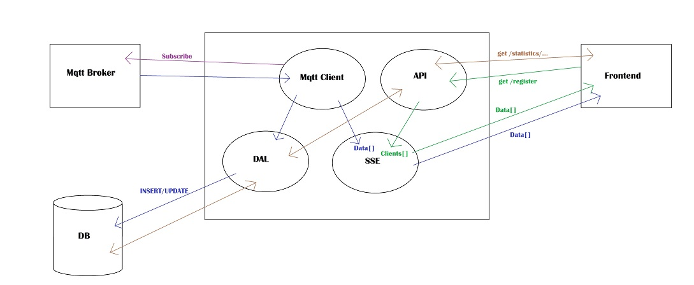

# Backend

- [Backend](#backend)
  - [Overview](#overview)
  - [Setting up](#setting-up)
    - [Server](#server)
      - [Requirements](#requirements)
      - [Enviroment variables](#enviroment-variables)
      - [Dependencies](#dependencies)
    - [Database](#database)
  - [Run the application](#run-the-application)
    - [Development](#development)
    - [Production](#production)
  - [API reference](#api-reference)
  - [Code quality](#code-quality)
    - [Local linting](#local-linting)
    - [GitHub Super-Linter](#github-super-linter)
  - [License](#license)

  

## Overview

Backend repository consists of 2 parts: **backend server** using Node.js' Express framework & **database** using MariaDB.

It acts as a middleman between IoT sensors and Frontend application receiving, storing and serving data.

See [IoT](https://github.com/Popup-Meeting-Rooms-Project/IoT) & [Frontend](https://github.com/Popup-Meeting-Rooms-Project/Frontend) repositories for the other parts of the project.

Architecture map

## Setting up

### Server

#### Requirements

**Node.js** 10.16.0 or newer is required. Latest LTS is recommended.

#### Enviroment variables

Configure `.env` file with database credentials to project root

    DB_HOST='localhost'
    DB_USER='username'
    DB_PASS='password'
    DB_NAME='database'

#### Dependencies

Install dependencies for development enviroment

    npm install

> Note that in production environment you can do `npm install --only=prod`.

### Database

Project uses [MariaDB](https://mariadb.org/). It is available for most Linux distribution repositories and Windows.

    # Arch based
    pacman -S mariadb
    # Debian based
    apt install mariadb-server

Database can be created using [this SQL file](Create%20Tables%20and%20Data%20in%20MariaDB.sql).

## Run the application

### Development

Run the main application `server.js` located in project root

    node server.js

or

    npm start

### Production

Run with

    npm run build

Or run as PM2 process

    pm2 start server.js

> Subsequently control pm2 apps by invoking assigned id or name, e.g. `pm2 start 0`

## API reference

> No SSL certificate means HTTPS protocol is disabled. If you run into CORS error, make sure your browser doesn't force HTTPS protocol

Base URL

`http://206.189.16.14/`

Register

`http://206:189.16.14/register`

Latest status of each room

`http://206.189.16.14/getAllRooms`

Same in nested format

`http://206.189.16.14/getAllRoomsTesting`

## Code quality

Several tools have been utilized to improve and sanitize codebase. Dotfiles are included within repository.

### Local linting

Files are being linted with

- ESLint
- Prettier
- sql-lint
- husky

Pre-commit hook is configured to run linting against staged files and prevent faulty commits.

### GitHub Super-Linter

Pushed commits and merge requests are linted using [GitHub Super-Linter](https://github.com/github/super-linter). See the configuration file [linter.yml](.github/workflows/linter.yml) for details.

## License

- [MIT License](LICENSE) - Copyright (c) 2021 Popup Meeting Rooms Project
